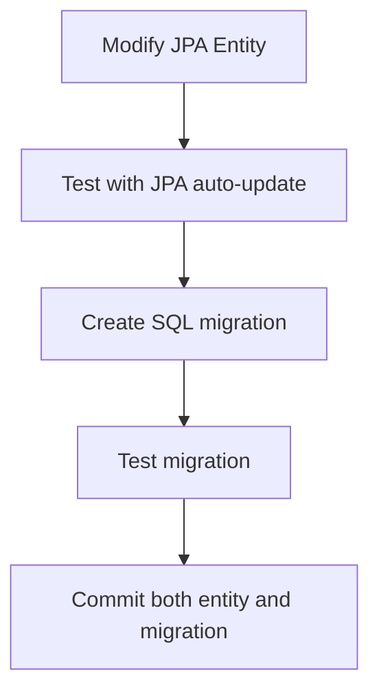
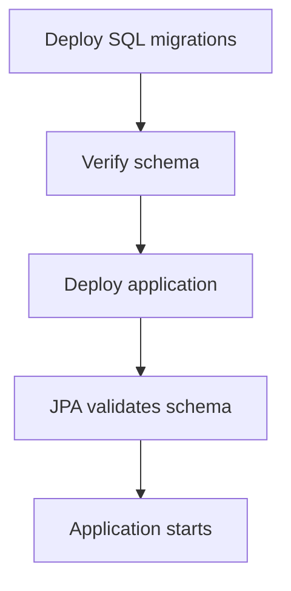

# JPA Entity and SQL Migration Sync Guide

## Overview

This guide explains how to keep your Spring Boot JPA entities and SQL migrations synchronized to avoid conflicts and ensure consistent database schema across all environments.

## Current Configuration

### Development Environment
```properties
# application.properties
spring.jpa.hibernate.ddl-auto=update
spring.jpa.show-sql=true
```
- **JPA Behavior**: Auto-creates/updates tables based on entities
- **SQL Migrations**: Used for initial setup and seed data
- **Risk**: Conflicts if both try to create same tables

### Production/Docker Environment
```properties
# application-docker.properties / application-prod.properties
spring.jpa.hibernate.ddl-auto=validate
spring.jpa.show-sql=false
```
- **JPA Behavior**: Only validates schema matches entities
- **SQL Migrations**: Responsible for all schema changes
- **Risk**: Validation fails if schema doesn't match entities

## Migration Strategy

### 1. Development Workflow



**Steps:**
1. **Modify JPA entity** (add field, change type, etc.)
2. **Test locally** with `ddl-auto=update`
3. **Create SQL migration** to match entity changes
4. **Test migration** in clean database
5. **Commit both** entity and migration files

### 2. Production Deployment



**Steps:**
1. **Run SQL migrations** first
2. **Verify schema** matches entities
3. **Deploy application** with `ddl-auto=validate`
4. **Monitor logs** for validation errors

## Entity Change Examples

### Example 1: Adding a New Field

**JPA Entity Change:**
```java
@Entity
public class Student {
    // ... existing fields
    
    @Column(name = "emergency_contact")
    private String emergencyContact; // NEW FIELD
    
    // ... getters and setters
}
```

**SQL Migration (06-add-emergency-contact.sql):**
```sql
-- Add emergency contact field to students table
ALTER TABLE students ADD COLUMN emergency_contact VARCHAR(100);

-- Update schema version
INSERT INTO schema_version (version, description, checksum) 
VALUES ('1.0.4', 'Add emergency contact field to students', 'emergency_contact_checksum');
```

### Example 2: Changing Field Type

**JPA Entity Change:**
```java
@Entity
public class FeePayment {
    // ... existing fields
    
    @Column(name = "amount_paid", precision = 10, scale = 2)
    private BigDecimal amountPaid; // Changed from Double to BigDecimal
    
    // ... getters and setters
}
```

**SQL Migration (07-update-amount-precision.sql):**
```sql
-- Update amount_paid column precision
ALTER TABLE fee_payments MODIFY COLUMN amount_paid DECIMAL(10,2);

-- Update schema version
INSERT INTO schema_version (version, description, checksum) 
VALUES ('1.0.5', 'Update fee payment amount precision', 'amount_precision_checksum');
```

### Example 3: Adding New Table

**JPA Entity (New):**
```java
@Entity
@Table(name = "academic_calendar")
public class AcademicCalendar {
    @Id
    @GeneratedValue(strategy = GenerationType.IDENTITY)
    private Long id;
    
    @Column(name = "event_date")
    private LocalDate eventDate;
    
    @Column(name = "event_description")
    private String eventDescription;
    
    // ... getters and setters
}
```

**SQL Migration (08-create-academic-calendar.sql):**
```sql
-- Create academic calendar table
CREATE TABLE IF NOT EXISTS academic_calendar (
    id BIGINT AUTO_INCREMENT PRIMARY KEY,
    event_date DATE NOT NULL,
    event_description VARCHAR(255) NOT NULL,
    created_at TIMESTAMP DEFAULT CURRENT_TIMESTAMP,
    updated_at TIMESTAMP DEFAULT CURRENT_TIMESTAMP ON UPDATE CURRENT_TIMESTAMP
);

-- Create indexes
CREATE INDEX idx_academic_calendar_date ON academic_calendar(event_date);

-- Update schema version
INSERT INTO schema_version (version, description, checksum) 
VALUES ('1.0.6', 'Create academic calendar table', 'academic_calendar_checksum');
```

## Migration File Naming Convention

```
mysql/init/
├── 01-init.sql              # Database setup
├── 02-add-receipt-number.sql # Feature additions
├── 03-create-tables.sql     # Complete schema
├── 04-seed-data.sql         # Initial data
├── 05-migration-strategy.sql # Strategy and versioning
├── 06-add-emergency-contact.sql # Entity changes
├── 07-update-amount-precision.sql
├── 08-create-academic-calendar.sql
└── XX-description.sql       # Future migrations
```

## Validation Process

### 1. Development Validation

```bash
# 1. Start with clean database
docker-compose down -v
docker-compose up mysql -d

# 2. Run migrations
docker exec -it school_mysql mysql -u root -proot school_management_system < mysql/init/01-init.sql
# ... run all migrations

# 3. Start application
./mvnw spring-boot:run

# 4. Check logs for validation errors
```

### 2. Production Validation

```bash
# 1. Backup existing database
./mysql/scripts/backup.sh

# 2. Run migrations
./mysql/scripts/migrate.sh

# 3. Verify schema
mysql -u root -p school_management_system -e "
SELECT 'Schema Validation' as check_type,
       COUNT(*) as table_count
FROM information_schema.tables 
WHERE table_schema = 'school_management_system';
"

# 4. Deploy application
# 5. Monitor logs for validation errors
```

## Common Issues and Solutions

### Issue 1: JPA Validation Fails

**Error:**
```
org.hibernate.tool.schema.spi.SchemaManagementException: Schema-validation: missing column [new_field] in table [students]
```

**Solution:**
1. Check if migration was run
2. Verify migration SQL syntax
3. Run missing migration
4. Restart application

### Issue 2: Migration Conflicts

**Error:**
```
Table 'students' already exists
```

**Solution:**
1. Use `IF NOT EXISTS` in migrations
2. Check migration order
3. Verify no duplicate migrations

### Issue 3: Data Type Mismatch

**Error:**
```
Schema-validation: wrong column type encountered in column [amount_paid] in table [fee_payments]
```

**Solution:**
1. Check entity field type
2. Verify migration data type
3. Update migration if needed
4. Test with sample data

## Best Practices

### 1. Always Test Migrations

```bash
# Test migration in isolation
docker-compose down -v
docker-compose up mysql -d
mysql -u root -proot school_management_system < mysql/init/XX-new-migration.sql
```

### 2. Use Version Control

```bash
# Commit both entity and migration
git add src/main/java/com/devtech/school_management_system/entity/Student.java
git add mysql/init/06-add-emergency-contact.sql
git commit -m "Add emergency contact field to Student entity and migration"
```

### 3. Document Changes

```sql
-- Always include descriptive comments
-- Migration: Add emergency contact field
-- Date: 2025-08-17
-- Author: Developer Name
-- Reason: Required for emergency notifications

ALTER TABLE students ADD COLUMN emergency_contact VARCHAR(100);
```

### 4. Backup Before Changes

```bash
# Always backup before major changes
./mysql/scripts/backup.sh
```

## Monitoring and Maintenance

### 1. Schema Version Tracking

```sql
-- Check migration status
SELECT * FROM schema_version ORDER BY applied_at DESC;

-- Verify all migrations applied
SELECT COUNT(*) as migration_count FROM schema_version;
```

### 2. Entity-Schema Sync Check

```sql
-- Compare entity fields with database columns
SELECT 
    TABLE_NAME,
    COLUMN_NAME,
    DATA_TYPE,
    IS_NULLABLE,
    COLUMN_DEFAULT
FROM information_schema.COLUMNS 
WHERE TABLE_SCHEMA = 'school_management_system'
ORDER BY TABLE_NAME, ORDINAL_POSITION;
```

### 3. Regular Validation

```bash
# Weekly validation script
#!/bin/bash
echo "Running weekly schema validation..."

# Check migration status
mysql -u root -p school_management_system -e "
SELECT 'Migration Status' as check_type, COUNT(*) as count FROM schema_version;
"

# Check table counts
mysql -u root -p school_management_system -e "
SELECT 'Table Counts' as check_type, COUNT(*) as count 
FROM information_schema.tables 
WHERE table_schema = 'school_management_system';
"

echo "Validation completed."
```

## Emergency Procedures

### 1. Rollback Migration

```bash
# If migration causes issues
./mysql/scripts/restore.sh ./backups/school_management_system_backup_20250817_143022.sql
```

### 2. Fix Schema Mismatch

```sql
-- If JPA validation fails, manually fix schema
-- Example: Add missing column
ALTER TABLE students ADD COLUMN missing_field VARCHAR(100);

-- Then update schema version
INSERT INTO schema_version (version, description) 
VALUES ('1.0.7', 'Manual fix for missing field');
```

### 3. Reset Development Environment

```bash
# Complete reset for development
docker-compose down -v
docker-compose up --build
```

## Summary

- **Development**: Use JPA auto-update for rapid development
- **Production**: Use SQL migrations for controlled deployments
- **Always**: Keep entities and migrations in sync
- **Test**: Every migration before deployment
- **Document**: All schema changes
- **Backup**: Before any schema changes

This approach ensures your database schema is consistent across all environments and your Spring Boot application can validate the schema correctly.
